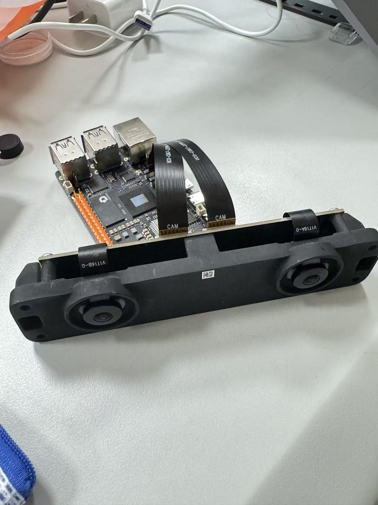

# 智能垃圾分类识别系统

## 项目简介

本项目基于 RDK X5 边缘 AI 开发平台，设计并实现了一套智能垃圾分类识别系统。

系统利用 RDK X5 高性能端侧 AI 计算能力，通过摄像头实时采集垃圾图像，并在设备端部署轻量化目标检测模型，实现垃圾目标检测与智能分类。

系统无需依赖云端服务器，即可完成本地 AI 推理，并将识别结果、类别标签以及检测置信度实时传输至电脑端进行可视化显示。

目前系统支持识别四大类生活垃圾：

- 可回收物
- 厨余垃圾
- 有害垃圾
- 其他垃圾

系统能够实时输出：

- 垃圾类别
- 检测置信度

为智能垃圾分类、智慧环保以及智能设备应用提供视觉识别解决方案。


---

# 项目背景

随着城市生活垃圾数量不断增加，垃圾分类已经成为智慧城市建设的重要组成部分。

传统垃圾分类方式主要依靠人工完成，存在以下问题：

- 分类效率较低
- 人力成本较高
- 分类准确率容易受到人为因素影响
- 难以实现自动化管理

近年来，随着人工智能、计算机视觉以及边缘计算技术的发展，利用 AI 视觉算法实现垃圾自动识别成为智能环保领域的重要方向。

本项目结合 RDK X5 边缘计算平台，将 AI 推理任务部署到设备端，实现低延迟、高效率、低网络依赖的智能垃圾分类识别。


---

# 项目目标

本项目主要实现以下目标：

1. 利用摄像头完成垃圾图像实时采集；
2. 基于 AI 模型完成垃圾目标检测；
3. 利用 RDK X5 实现边缘端实时推理；
4. 实现垃圾类别自动识别；
5. 将识别结果实时显示于电脑端；
6. 构建可扩展的智能垃圾分类系统。


---

# 系统整体架构

系统采用：

**摄像头采集 + RDK X5边缘AI推理 + 电脑端可视化显示**

的整体架构。


```
摄像头
  │
  ▼
实时图像采集
  │
  ▼
RDK X5边缘计算平台
  │
  ▼
AI目标检测模型
  │
  ▼
垃圾类别识别
  │
  ▼
结果数据传输
  │
  ▼
电脑端可视化显示
```


---

# 系统工作流程


## 1. 图像采集

系统通过摄像头实时获取垃圾目标图像，并将视频流输入至 RDK X5 开发板。


## 2. 图像预处理

采集到的图像经过预处理，包括：

- 图像尺寸调整
- 数据格式转换
- 输入数据优化

提高模型运行效率。


## 3. AI模型推理

系统在 RDK X5 平台部署轻量化目标检测模型。

模型对输入图像进行分析，并输出：

- 检测目标位置
- 垃圾类别
- 分类置信度


## 4. 数据传输

RDK X5 完成 AI 推理后，将识别结果传输至电脑端。


## 5. 结果可视化

电脑端实时显示：

- 摄像头视频画面
- 垃圾目标检测框
- 垃圾类别名称
- 分类置信度

实现直观的人机交互。


---

# 项目特点


## 1. 边缘AI实时计算

系统基于 RDK X5 平台运行 AI 推理任务。

相比传统云端识别方案：

- 降低数据传输压力
- 减少网络依赖
- 提升响应速度
- 降低系统延迟


## 2. 智能垃圾分类识别

系统支持以下四类垃圾识别：

| 垃圾类别 | 示例 |
| --- | --- |
| 可回收物 | 塑料瓶、纸张、金属 |
| 厨余垃圾 | 食物残渣、果皮 |
| 有害垃圾 | 电池、化学用品 |
| 其他垃圾 | 普通生活垃圾 |


## 3. 实时检测展示

系统能够实时显示：

- 检测结果
- 类别标签
- 置信度信息

方便用户观察 AI 识别过程。


## 4. 可扩展设计

系统具备进一步扩展能力，可结合：

- 智能垃圾桶
- 自动分类机构
- 物联网管理平台
- 智慧城市系统

实现更加完整的智能环保方案。


---

# 硬件平台


| 硬件设备 | 功能 |
| --- | --- |
| RDK X5开发板 | AI模型推理与边缘计算 |
| 摄像头模块 | 实时采集垃圾图像 |
| 电脑 | 接收数据并显示识别结果 |
| 外围设备 | 提供系统运行支持 |


---

# 软件环境


主要软件环境：

- Linux 操作系统
- Python 开发环境
- 深度学习推理框架
- 目标检测算法模型
- OpenCV 图像处理库


---

# AI模型部署流程


```
数据采集

↓

数据处理

↓

模型训练

↓

模型优化

↓

模型转换

↓

RDK X5部署

↓

实时AI推理

```


---

# 技术路线


项目整体技术路线：

```
垃圾数据采集

↓

数据标注与处理

↓

目标检测模型训练

↓

模型优化部署

↓

RDK X5端侧运行

↓

实时检测显示

```


核心技术包括：

- 计算机视觉
- 深度学习目标检测
- 边缘 AI 推理
- 图像处理
- 数据可视化


---

# 项目展示


## 硬件展示

本系统硬件主要由 RDK X5 边缘 AI 开发平台、摄像头模块以及电脑端显示设备组成。

系统通过摄像头采集垃圾图像，并利用 RDK X5 完成边缘 AI 推理。


### RDK X5硬件平台




图：RDK X5边缘AI开发平台与摄像头连接


---

# 项目演示视频


本项目运行演示视频：

[智能垃圾分类识别系统演示](https://www.bilibili.com/video/BV1eAME6aEKv/)


---

# 应用场景


## 智能垃圾桶

结合自动投放机构，实现垃圾自动分类。


## 智慧社区垃圾分类

辅助居民完成垃圾分类，提高分类效率。


## 智慧城市环保系统

结合物联网平台，实现垃圾数据统计与管理。


## 智能机器人视觉模块

作为机器人环境感知能力的一部分。


---

# 后续优化方向


## 1. 提升模型性能

进一步优化：

- 检测准确率
- 推理速度
- 复杂环境适应能力


## 2. 自动分类功能扩展

未来结合机械结构，实现：

- 自动识别
- 自动分拣
- 自动投放


## 3. 物联网平台接入

实现：

- 数据统计
- 设备管理
- 远程监控


---

# 项目总结


本项目基于 RDK X5 边缘 AI 平台，实现了一套完整的智能垃圾分类识别系统。

通过计算机视觉算法与边缘计算技术结合，实现垃圾目标检测、类别识别以及电脑端实时可视化展示。

系统具有实时性强、响应速度快、部署灵活等特点，为未来智能环保设备开发提供了一种可行方案。


---

# 开源协议


本项目采用开源方式发布。

欢迎学习交流与二次开发。
